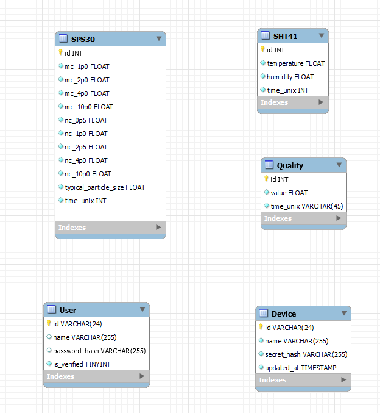

# Database

MariaDB is used as database service.

Below is a picture of the database schema.

## Setup

An initial SQL script is generated using MySQL Workbench and can be found in `data/seed.sql`. This
file is loaded when the database container is started for the first time. It creates the necessary
tables and users for the application to work.
