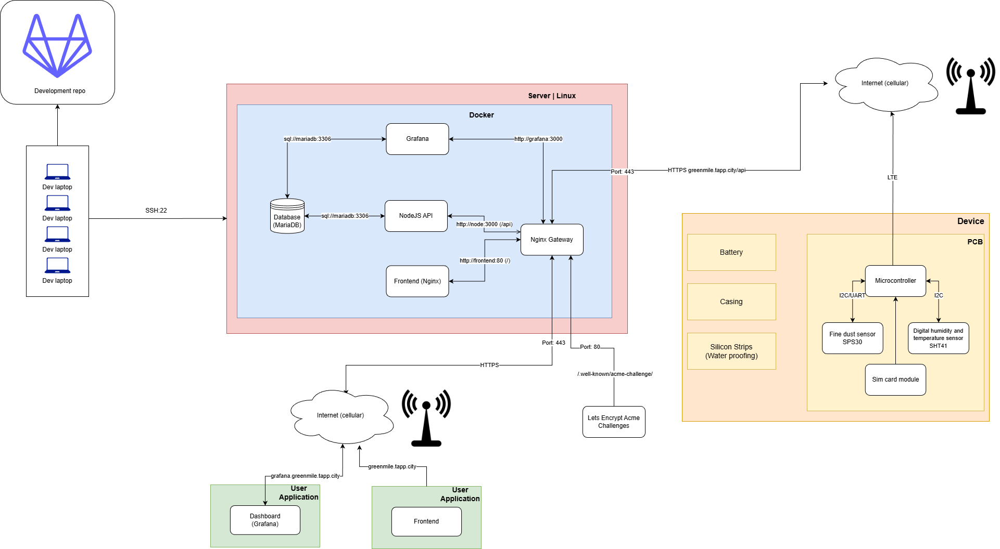

# System Architecture

## Overview

Replace `domain.nl` with your own domain name in the diagram.

### Server

The server hosts all services using Docker containers. It runs a reverse proxy (Traeffik) that
handles incoming requests and routes them to the appropriate service.

See [Docker](/architecture/docker) for more information about the services running on the server.

### Outside Services

There are two outside services: the Grafana Dashboard and the frontend application displaying the
air quality to the user.

### Embedded Devices

The embedded devices post data to `cmb.domain.nl/api/*` endpoints using HTTPS POST requests.
