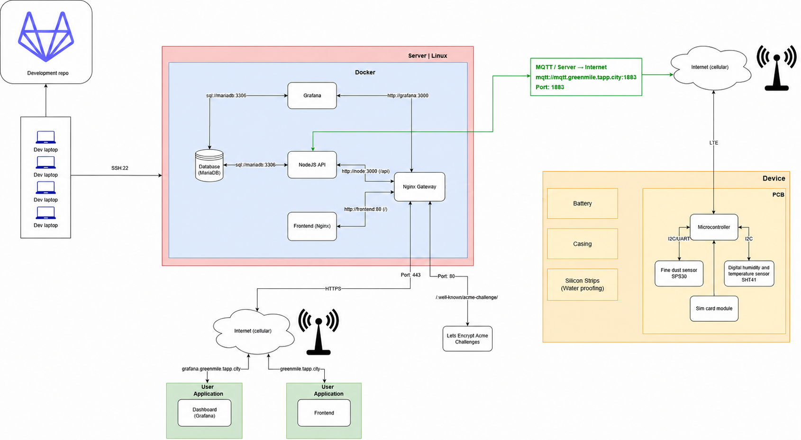

# System Architecture

## Overview

This document provides a high-level overview of the **GreenMile IoT environmental monitoring system**. It describes how data flows from embedded sensor devices in the field to the cloud-based infrastructure and finally to end-user applications.

The system is designed to collect environmental data (fine dust, temperature, humidity), transmit it securely over cellular networks, process and store it in a centralized backend, and present it through web-based user interfaces and dashboards.

## System Components

### 1. Embedded Devices (IoT Sensor Units)

The embedded devices are deployed in the field to collect environmental data. Each device consists of:

- **Microcontroller (ESP32-S3 WROOM-1)**  
  Controls the device, reads sensor data, and manages communication.

- **Sensors**
  - **SPS30 Air Pollution Sensor** — Measures particulate matter (fine dust).
  - **SHT41 Sensor** — Measures temperature and humidity.

- **Connectivity**
  - **SIM Module (LTE)** — Sends data securely to the backend via HTTPS (`/api` endpoints).

- **Additional Hardware**
  - 8-digit display module  
  - WS2812B LED strip with power regulation module  

- **Communication Protocols**
  - Sensors communicate with the microcontroller via **I2C / UART**
  - Data is transmitted to the server via **HTTPS over LTE**

### 2. Server Infrastructure

A Linux-based server hosts all backend services within a [**Dockerized environment**](docker.md).

#### Reverse Proxy / Gateway

- **Traefik (or Nginx Gateway)**  
  - Handles incoming traffic on **ports 80 (HTTP)** and **443 (HTTPS)**
  - Routes requests to internal services:
    - `/api` → Backend API
    - `/` → Frontend
    - Grafana → Grafana service
  - Manages **SSL/TLS termination**
  - Supports automatic certificate provisioning via **Let's Encrypt (ACME)**

#### Backend Services

- **Node.js API**
  - Receives data from IoT devices via HTTPS POST requests (`/api/*`)
  - Processes and validates incoming data
  - Stores data in the database
  - Serves data to frontend applications

- **Database (MariaDB)**
  - Stores:
    - Sensor measurements
    - User data
    - Application state
  - Accessible internally within Docker (`mariadb:3306`)

- **Frontend (Nginx)**
  - Serves the static web application to end users

- **Grafana**
  - Connects directly to MariaDB
  - Provides real-time and historical data visualization dashboards

### 3. Network & Communication

- **Cellular Network (LTE)**
  - Acts as the bridge between IoT devices and the server
  - Devices send HTTPS requests to the backend API

- **Internet**
  - Enables communication between devices, server, and users

- **Security**
  - All external communication occurs over **HTTPS (port 443)**
  - SSL certificates are automatically managed

### 4. User Applications

End users interact with the system through web-based interfaces:

- **Frontend Application**
  - Main user interface
  - Displays environmental data and system status

- **Grafana Dashboard**
  - Advanced data visualization
  - Charts, analytics, and historical insights

### 5. Development Infrastructure

- **Version Control (Git)**
  - Central repository for all source code

- **Developer Access**
  - Developers connect to the server via **SSH (port 22)**
  - Used for deployment, maintenance, and debugging

## Data Flow

1. Sensors collect environmental data (fine dust, temperature, humidity)  
2. Microcontroller processes the data  
3. Device sends data via **LTE (HTTPS POST)** to the backend API  
4. Reverse proxy routes the request to the **Node.js API**  
5. API processes and stores data in **MariaDB**  
6. Data is accessed by:
   - **Frontend** for user interaction  
   - **Grafana** for visualization and analytics  

## Stakeholders

- **Ruth van Dijken** — Green Mile Foundation  
- **Tom van Arman** — Tapp (project coordination and communication)

