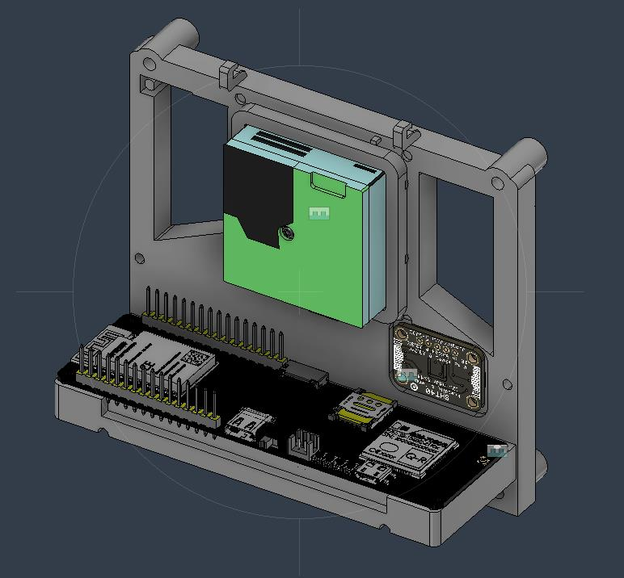
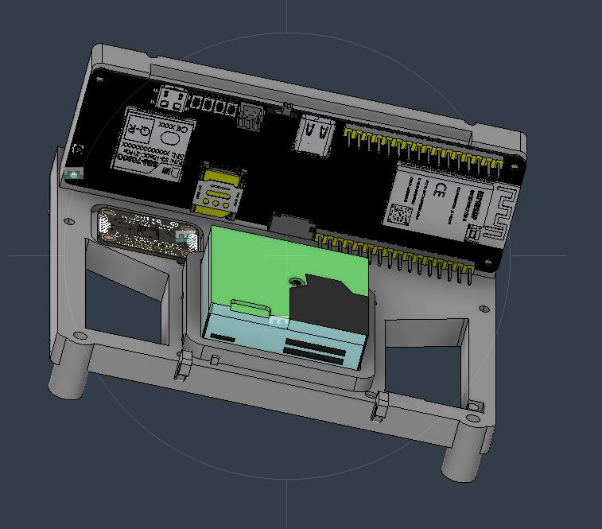
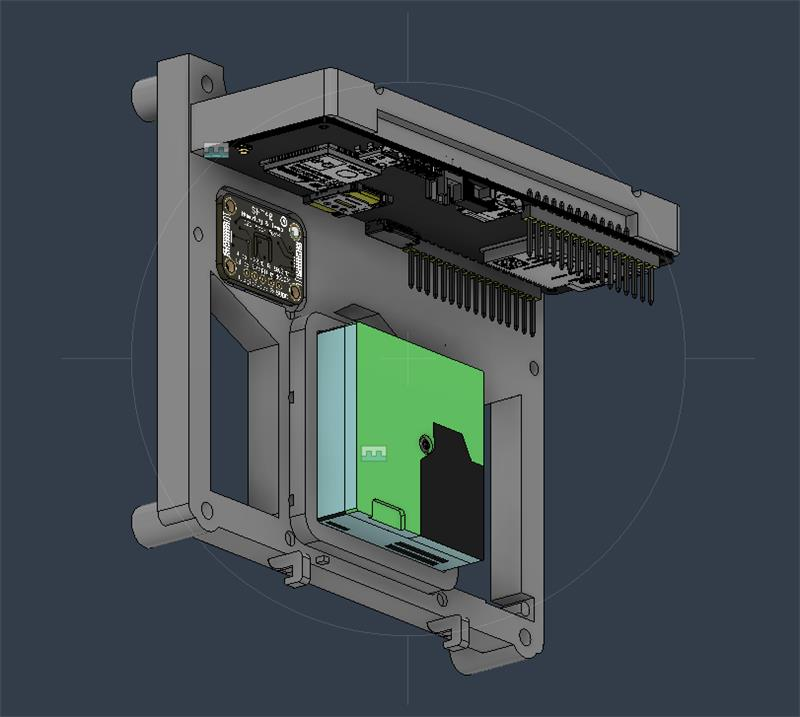
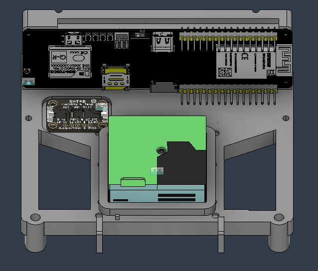
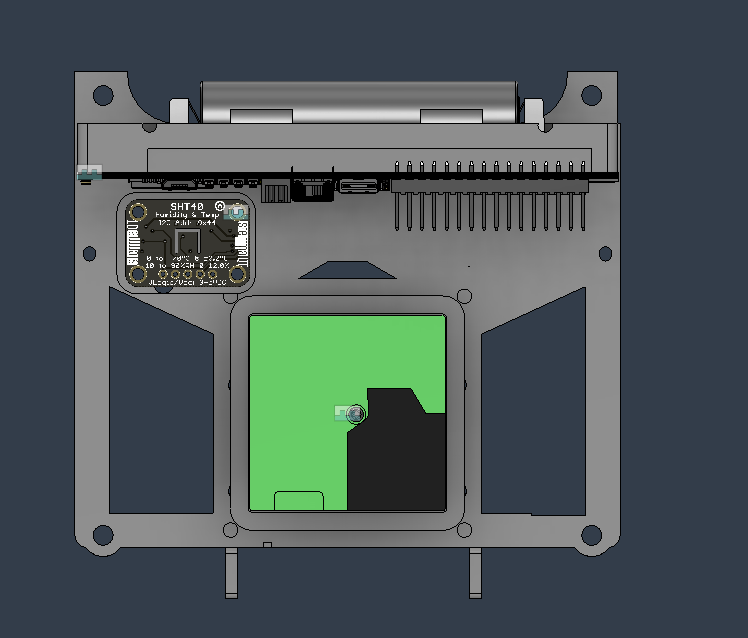
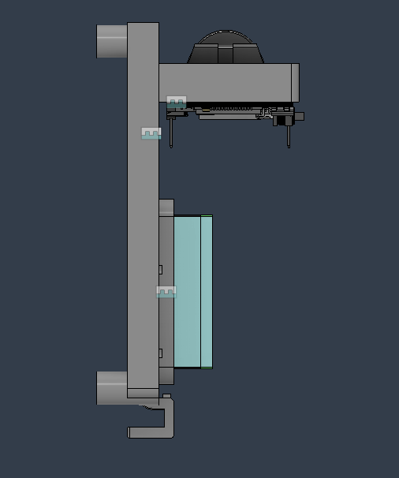
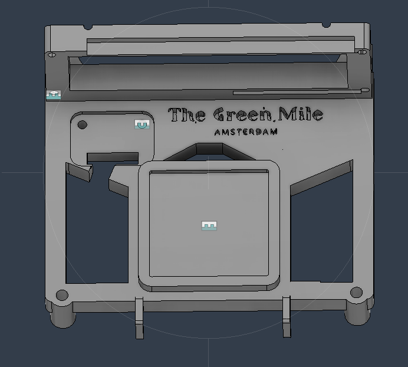

# The Bracket

## Table of Contents
- [The Bracket](#the-bracket)
- [Versions](#versions)
  - [Version 2](#version-2)
  - [Version 3](#version-3)
  - [Version 3.3](#version-33)
- [Inserts](#inserts)
- [How to Print](#how-to-print)
  - [1. Download the STL file](#1-download-the-stl-file)
  - [2. Order the print](#2-order-the-print)
  - [3. Check your settings (recommended)](#3-check-your-settings-recommended)
  - [4. Receive and assemble](#4-receive-and-assemble)

---

Before starting this task, earlier versions of the design were created, but they did not fully meet the required standards. The layout was unclear, components were not well organized, and there was limited consideration for practical aspects such as airflow and cable management.

The main goal of this project is to design a functional and efficient smart sensor box (for air quality sensors). The enclosure integrates multiple components such as a microcontroller, an SPS30 sensor, a temperature sensor, and supporting electronics into a compact and practical design.

Based on feedback and previous iterations, the goal is to improve the design so that it is not only technically correct, but also clear, structured, and suitable for real-world use and presentation. It is also important that it is clearly visible where each component should be placed and how everything fits together.

# Versions

## Version 2

In this new design, the walls and the segment displays have been removed to create a more open and efficient structure. This improves both the airflow and the overall accessibility of the internal components.

Additionally, a solution has been implemented to properly manage the wiring, ensuring that the cables are neatly organized and do not obstruct the air intake. As a result, the design is cleaner in appearance, more functional, and better suited for reliable performance. The removal of the segment displays also improves battery life.

---

## Version 3

With this updated design, the mounting holes have been adjusted so that screws can easily slide into place when attaching the bracket to the outer box.

The hooks on the front have been enlarged to ensure that cables fit properly and do not obstruct the airflow. Additionally, part of the connecting beam has been removed to allow the pins to align correctly and fit properly within the frame.

---

## Version 3.3

In this version, I improved the aesthetics by removing unnecessary holes and making several cable management improvements. The design now allows for easier detachment of components, and the cable opening has been enlarged to improve cable routing. Additionally, the Green Mile logo has been incorporated into the design.

---

## Inserts

For the mounting holes used to secure the components, M2 threaded inserts must be installed after printing. These inserts are made of copper, which allows them to conduct heat efficiently.

To install them, place the insert into the hole and apply heat using a soldering iron. As the insert heats up, it will gradually sink into the plastic. Make sure the insert is aligned properly and pressed in evenly to ensure a secure and flush fit.

---

## How to Print

There are multiple ways to print this design. In this guide, the easiest method is explained for users who do not have access to a 3D printer.

### 1. Download the STL file

You can find the STL file in the following directory:

`\docs\assets\design`

Download the latest version of the enclosure (or the required part).

### 2. Order the print

There are various online 3D printing services where you can upload your STL file and have it printed and shipped to you.

[Upload the file](../assets/design/GreenMileBracketV3.3.stl), choose your preferred material (e.g., PLA or PETG), and select the desired quality and color. After that, you can place your order.

### 3. Check your settings (recommended)

Before ordering, make sure:

- The model is scaled correctly  
- The walls are thick enough for printing  
- No parts are floating or broken  

Most services will check this automatically, but it is recommended to verify it yourself.

### 4. Receive and assemble

Once the print arrives, you can assemble the components. Some parts may require additional steps, such as inserting threaded inserts or cleaning up small imperfections.