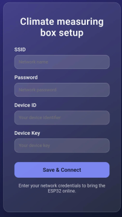

# Setup: Air Pollution Sensor Box

This guide explains how to connect your air pollution sensor box to the Green Mile system.

## Step-by-Step Instructions

1. **Start the program:**
    - Upload and start the program on the microcontroller.

2. **Sensor box blinks purple:**
    - After a few seconds, the sensor box should start blinking purple.

3. **Connect to Wi-Fi:**
    - Connect your computer or smartphone to the following Wi-Fi network:
      - **Name:** `ESP_Config`
      - **Password:** `test1234`

4. **Open the configuration page:**
    - Open a web browser and enter [192.168.4.1](http://192.168.4.1/) in the address bar.

5. **Create an account:**
    - Create an [account](https://github.com/tomvanarman/GreenMileAirQualitySensor/blob/main/docs/web/frontend.md) if you do not already have one.

**Server credentials:**
  - **IPV4:** 46.62.232.90
  - **IPV6:** 2a01:4f9:c013:29cb::/64
  - **User:** root
  - **Password:** green-mile

6. **Register your device:**
    - Go to [https://greenmile.tapp.city/devices](https://greenmile.tapp.city/devices).
    - Register a new device and save the **Device ID** and **Device Key (Secret Key)**.
    - :warning: **Important:** The Device Key is only visible once!

7. **Enter Wi-Fi and device data:**
    - On the configuration page, enter the following information:
      - SSID (your Wi-Fi name)
      - Password (your Wi-Fi password)
      - Device ID
      - Device Key

    

8. **Connect the sensor box:**
    - Click "Save & Connect". The sensor box should now connect.
    - If it continues blinking, please try again.

9. **Check your data:**
    - Visit [grafana](https://grafana.greenmile.tapp.city/) or [cmb](https://greenmile.tapp.city/devices) to view your sensor data.
    - Make sure the sensors are correctly connected to the prototype, otherwise the should be blinking blue.

---

