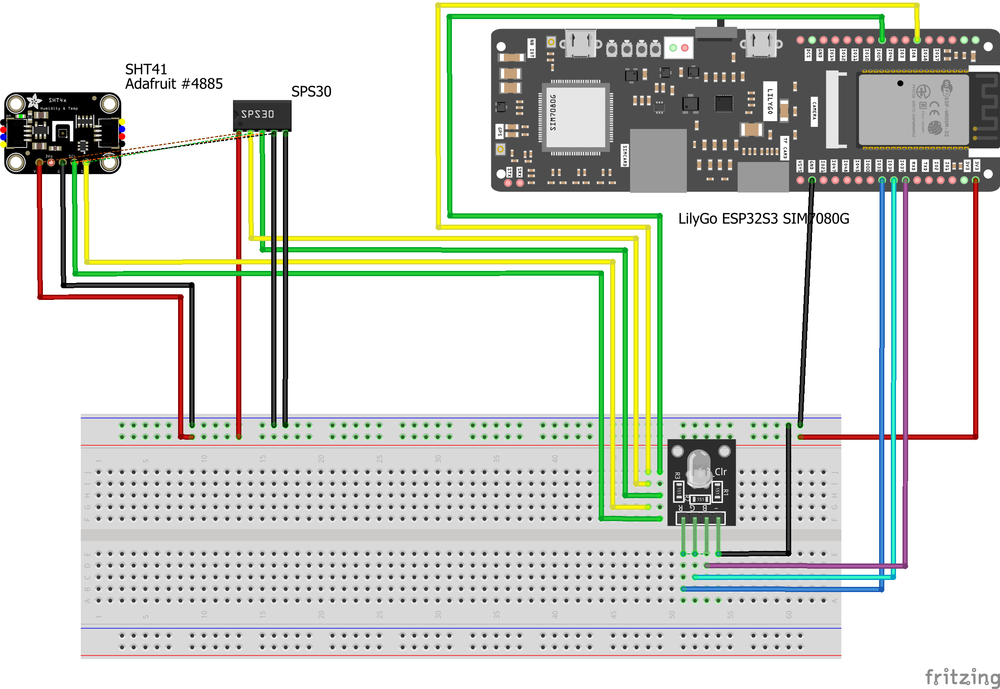
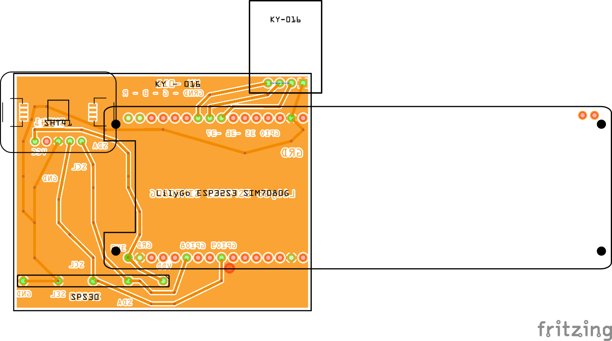

# Green Mile Project – Hardware Architecture

This document describes the hardware design of the Green Mile project. The system is built around an
ESP32 (LILYGO TTGO T-SIM7080G-S3), which controls a RGB LED and reads data from
environmental sensors. The design was created in Fritzing as preparation for developing a custom
PCB.

The ESP32 acts as the central controller and communicates with multiple components. It controls the
LED strip through a single data connection and reads measurements from an SPS30 particulate matter
sensor and an SHT41 temperature and humidity sensor.

The RGB led  is connected using 3 PGIO pins and ground, allowing the microcontroller to control the LEDs.

The SPS30 and SHT41 sensors are connected using I2C communication. This means both sensors share the
same SDA (data) and SCL (clock) lines connected to the ESP32. They also share the same power and
ground connections, which keeps the wiring efficient and suitable for a PCB design.

A breadboard was used in this project for the Fritzing setup and wiring validation. This prototype
step was chosen to verify the connections before moving to a custom PCB design.

The Fritzing design serves as both a visual reference and a starting point for the PCB layout. It
can be directly used to place components and route connections in the PCB view.

The PCB design phase has now started. The first component placement and routing decisions are
currently being worked out based on this wiring model. The board will be manufactured using a CNC
machine, so the PCB is being designed as a single-sided board.

Overall, this hardware design provides a clear structure in which the ESP32 controls both the LED
output and the connected sensors. The breadboard-based Fritzing prototype helps validate the design
before finalizing the PCB layout.

[Fritzing scheme file](..//assets/greenmilefritzing.fzz)

## PCB Design Progress

An initial PCB design has been started and is shown below.

During the design process, several issues were encountered and resolved:
- The PCB first had to be changed to a single-sided design because it will be produced using a CNC machine.
- A copper infill was added later to improve the ground connection.
- After feedback, several short circuits were found in the traces and were corrected in the final design.

