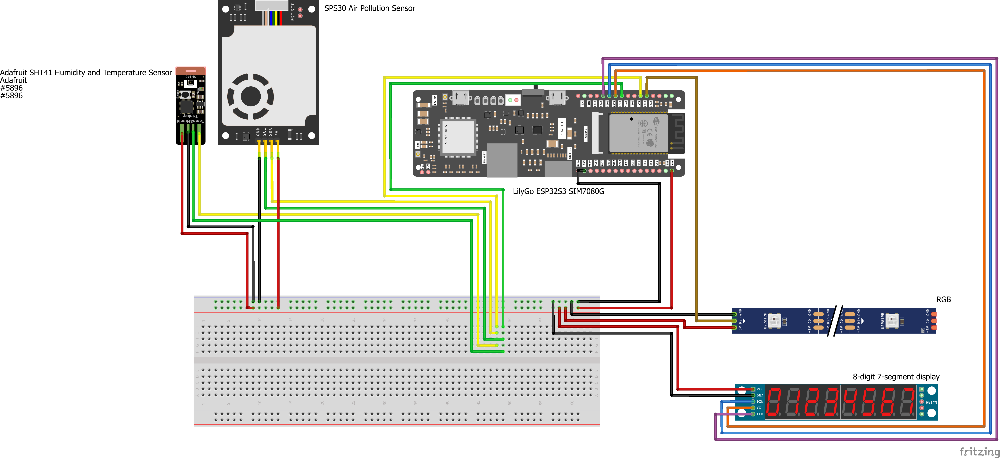

# Wiring Documentation

## 1. Introduction
This document provides a comprehensive overview of the wiring diagram used in our hardware setup. It is intended to help team members and stakeholders understand the connections and components within the system.

## 2. Table of Contents
1. Introduction
2. Table of Contents
3. Wiring Diagram
4. Legend
5. Conclusion & Recommendations

## 3. Wiring Diagram

## 4. Legend
| Color   | Signal/Function           |
|---------|---------------------------|
| Red     | Power (3.3V)              |
| Black   | Ground (GND)              |
| Yellow  | SDA (I2C Data)            |
| Green   | SCL (I2C Clock)           |
| Ochre   | RGB Data                  |
| Blue    | Segment Display Data      |
| Orange  | Chip Select (CS)          |
| Purple  | Clock (CLK)               |

**Color Coding Explanation:**
- **Red** wires are used for all 3.3V power connections.
- **Black** wires are used for all ground (GND) connections.
- **Yellow** and **Green** wires are used for I2C communication (SDA and SCL).
- **Ochre** is used for RGB data lines.
- **Blue** is used for segment display data.
- **Orange** is used for chip select (CS) lines.
- **Purple** is used for clock (CLK) lines.

*Please ensure to follow the color coding for easier troubleshooting and maintenance. If your wiring uses different colors, update this legend accordingly.*

*Note: Refer to the actual diagram for the exact symbols and their placement. Update the legend as needed for your specific hardware setup.*

## 5. Conclusion & Recommendations
The wiring diagram above serves as a reference for assembling and troubleshooting the hardware. Ensure all connections are secure and double-check the legend for component identification. For any modifications or extensions, update this documentation accordingly to maintain clarity and consistency.