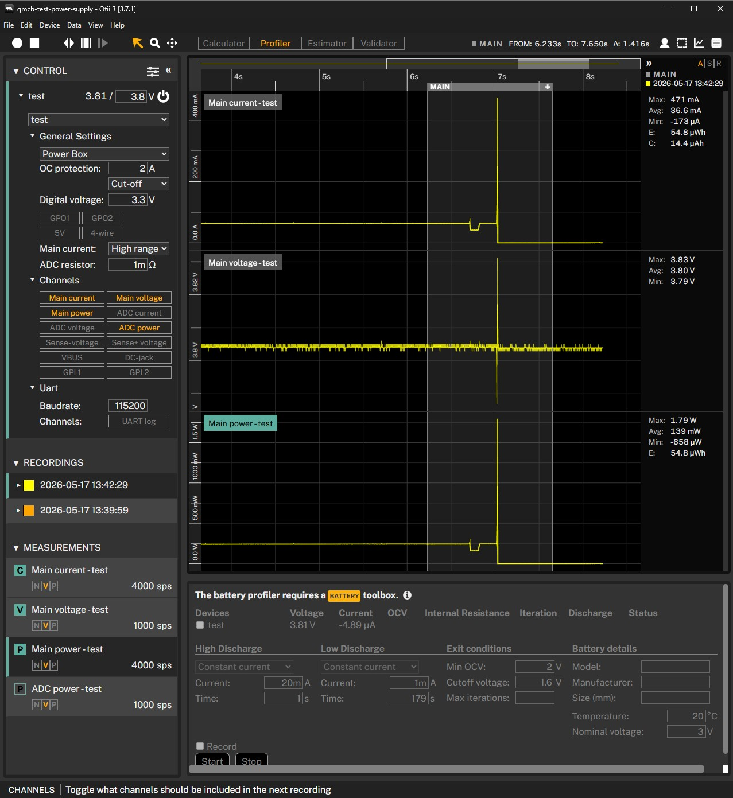
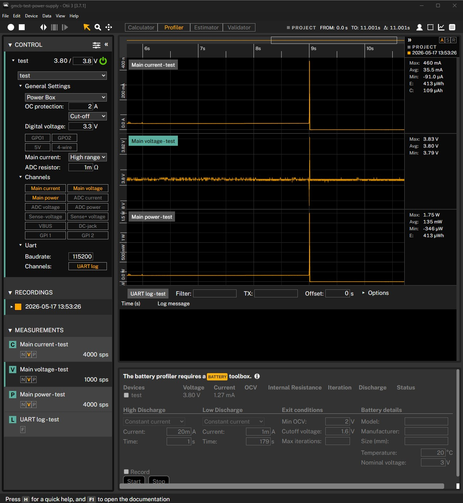
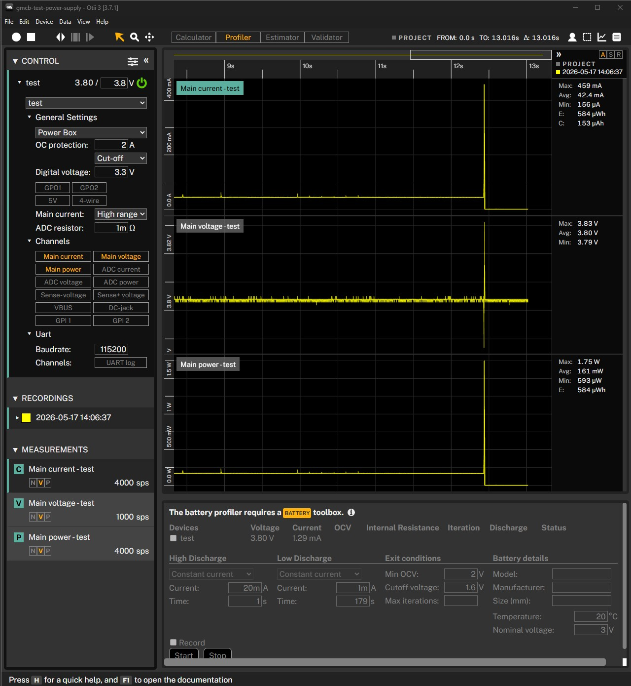
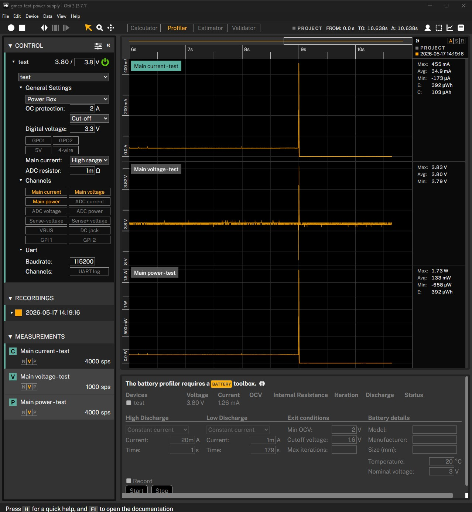
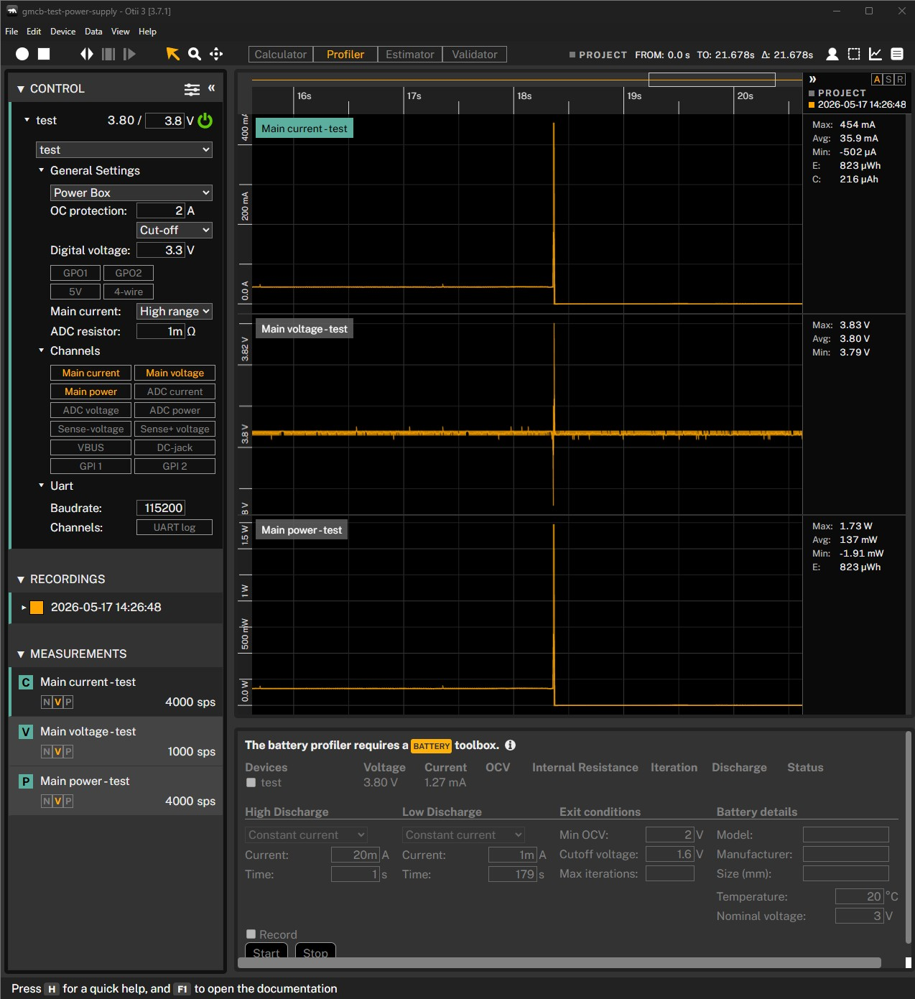

# SIM7080G Test: DC3 UVP Stability

## Purpose

Find why the board powered down or stopped responding when the modem rail was
enabled. Earlier tests showed the board could boot and print serial logs, but
the failure happened around BLDO1 and DC3 modem rail setup.

## Firmware

PlatformIO environments:

```text
bldo1dc3
bldo1dc3hold
bldo1dc3pins
bldo1dc3pwm
bldo1dc3nouvp
```

Upload commands:

```powershell
cd embedded/testsim
.\upload-monitor.cmd bldo1dc3 COM3
.\upload-monitor.cmd bldo1dc3hold COM3
.\upload-monitor.cmd bldo1dc3pins COM3
.\upload-monitor.cmd bldo1dc3pwm COM3
.\upload-monitor.cmd bldo1dc3nouvp COM3
```

## What The Firmware Tested

- BLDO1 level shifter rail at `3300 mV`.
- DC3 modem rail at `3000 mV`.
- No SIM stack and no PWRKEY pulse.
- No PMU readback after DC3 in the hold variants.
- Modem PWRKEY and DTR held low before DC3 in the pin-safe variant.
- DC3 PWM mode in the PWM variant.
- AXP2101 DC3 low-voltage PMIC turn-off disabled in the `nouvp` variant.

## Observed Result

The board repeatedly dropped to a very low-current state after BLDO1 and DC3
were enabled. Otii showed the input voltage stayed stable, so this was not a
bench supply collapse.

Otii captures from failed/stopped variants:











Key findings:

- `bldo1dc3hold` still stopped even though it avoided PMU I2C reads after DC3.
- `bldo1dc3pins` still stopped even with PWRKEY and DTR held low before DC3.
- `bldo1dc3pwm` was not accepted as the final fix because it did not provide the
  repeated stable heartbeat seen later.
- `bldo1dc3nouvp` stayed alive and printed the heartbeat repeatedly:

```text
bldo1dc3nouvp alive, no PMU readback after DC3
```

The CHG LED also kept blinking with `bldo1dc3nouvp`.

## Conclusion

The critical PMU fix is to disable AXP2101 DC3 low-voltage PMIC turn-off before
enabling the SIM7080G DC3 modem rail:

```cpp
PMU.disableDC3LowVoltageTurnOff();
PMU.setDC3LowVoltagePowerDowm(false);
PMU.setDC3Voltage(3000);
PMU.enableDC3();
```

This made the modem rail stable enough to continue into UART and SIM tests.
