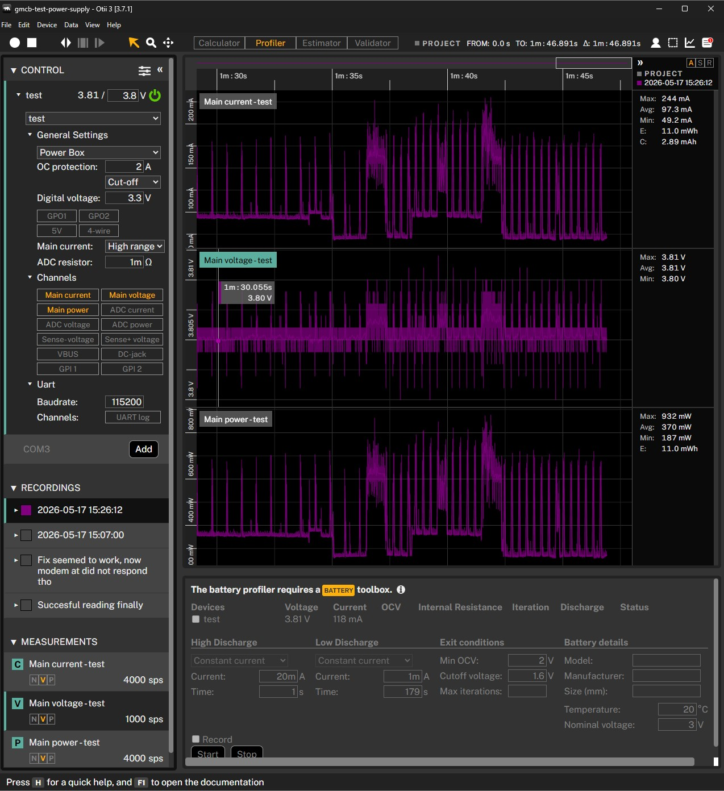

# SIM7080G Test: Successful Cat-M Validation

## Purpose

Record the final successful SIM7080G Cat-M test after the PMU rail fix and the
mechanical short were resolved.

## Firmware

PlatformIO environment:

```text
catm
```

Upload command:

```powershell
cd embedded/testsim
.\upload-monitor.cmd catm COM3
```

## Test Setup

- Otii connected to the board battery input.
- Main voltage: `3.8 V`.
- OCP: `2 A`.
- Main current: high range.
- USB-C used for ESP32 serial.
- SIM APN: `iot.1nce.net`.
- Preferred radio access: Cat-M.
- LTE antenna connected.
- Metal bolt near the SIM7080G/NB-IoT area moved away so it no longer touched
  the board.

## PMU Setup Used

- Hold modem PWRKEY and DTR low before modem rails.
- Enable BLDO1 level shifter rail at `3300 mV`.
- Disable AXP2101 DC3 low-voltage PMIC turn-off.
- Enable DC3 modem rail at `3000 mV`.
- Skip BLDO2 GNSS antenna rail for cellular-only testing.
- Disable TS pin measurement.

## Observed Result

The successful run was repeated and produced the same result.

Otii capture from the successful run:



Power profile during the captured run:

- Main voltage stayed around `3.80-3.81 V`.
- Main current max: about `244 mA`.
- Main current average: about `97.3 mA`.
- Main power max: about `932 mW`.
- Main power average: about `370 mW`.

Key serial output:

```text
Modem responded to AT.
SIM is ready.
Network mode now: 2
Preferred mode now: 1
Registration: registered roaming (5), CSQ: 99
Registered on LTE network.
Operator: Odido
Bearer is active.
Local IP: 10.197.213.1
+CCLK: "26/05/17,15:27:48+08"
+SNPING4: 1,8.8.8.8,469
Ping test: PASS
HTTP bytes received: 373
HTTP test: PASS
SIM setup is working
```

The HTTP request returned a `301 Moved Permanently` response, but this still
proves internet access because the modem received a real HTTP response from the
remote server.

SIM identifiers were printed during the test but are intentionally not recorded
here.

## Conclusion

The SIM7080G setup is confirmed working end to end:

- ESP32-to-modem UART works.
- SIM card is detected and ready.
- Cat-M registration works.
- PDP bearer activation works.
- The modem receives an IP address.
- Ping works.
- HTTP data retrieval works.

This is the reference result for future SIM7080G integration work.
