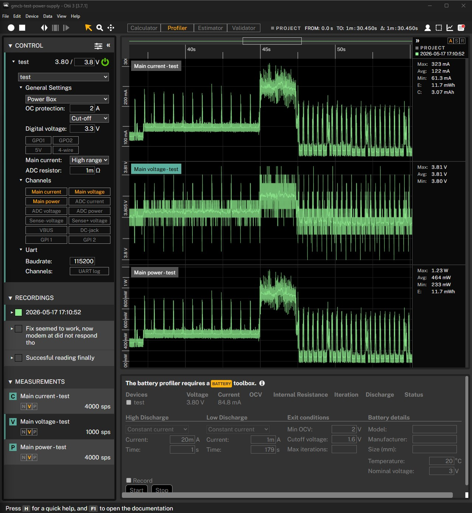

# ESP32 Final Integration Test: SIM7080 + SPS30 + SHT41

## Purpose

Record the final successful full-system integration test using the ESP32,
SIM7080 modem, SPS30 particulate sensor, and SHT41 temperature/humidity
sensor.

This test validates:

- SIM7080 LTE operation
- HTTPS payload transmission
- SPS30 measurement collection
- SHT41 sensor operation
- Deep sleep scheduling
- I2C recovery handling
- Overall power profile behavior

The test was considered successful despite some remaining intermittent I2C noise
on the SHT41 sensor.

## Firmware

PlatformIO environment:

```text
test
```

Upload command:

```powershell
cd embedded/test
.\upload-monitor.cmd test COM3
```

## Test Setup

- Otii connected to the board battery input.
- Main voltage: `3.8 V`.
- OCP: `2 A`.
- Main current: high range.
- USB-C used for ESP32 serial.
- SIM7080 used for LTE communication.
- WiFi intentionally disabled.
- SPS30 connected on I2C.
- SHT41 connected on I2C.
- Sensor I2C pins:
  - SDA: `GPIO8`
  - SCL: `GPIO9`

## PMU Setup Used

- SIM7080 modem rail enabled through PMU.
- BLDO1 enabled for logic level rail.
- LTE modem powered during measurement and HTTPS transmission.
- Deep sleep enabled after successful data transmission.

## Observed Result

The full system booted successfully and completed the intended operational
cycle.

Otii capture from the successful run:



Power profile during the captured run:

- Main voltage stayed around `3.80-3.81 V`.
- Main current max: about `323 mA`.
- Main current average: about `122 mA`.
- Main power max: about `1.23 W`.
- Main power average: about `464 mW`.

The power profile clearly showed:

- LTE modem startup activity
- SPS30 warm-up current increase
- HTTPS transmission current bursts
- Successful transition into deep sleep

## Key Serial Output

### Modem and Network

```text
[WARN] No WiFi credentials configured, using SIM7080
[INFO] Disconnected from WiFi

[INFO] Waiting for modem AT response...
[WARN] No AT response from modem
[WARN] No AT response from modem
[OK] Modem started!

Network register info: : Registered, roaming.
GPRS status: : connected
[OK] Network registration completed!

[OK] System time synchronized from SIM7080
```

This confirms:

- Correct WiFi fallback behavior
- Successful SIM7080 startup
- LTE registration
- PDP context activation
- Network time synchronization

## I2C Detection

```text
[OK] SHT41 found at 0X44
[OK] SPS30 found at 0X69

[OK] SHT41 and SPS30 are responding on I2C
```

Both sensors were detected successfully on the I2C bus.

## SPS30 Operation

The SPS30 initialized successfully and produced valid measurements.

Example payload:

```json
{
  "mc_1p0": 0.002494,
  "mc_2p0": 0.003043,
  "mc_4p0": 0.003374,
  "mc_10p0": 0.003544,
  "nc_0p5": 0.016019,
  "nc_1p0": 0.019293,
  "nc_2p5": 0.019833,
  "nc_4p0": 0.019921,
  "nc_10p0": 0.019936,
  "typical_particle_size": 0.522326,
  "time_unix": 1779027073
}
```

HTTPS transmission result:

```text
+SHREQ: "POST",204,0
HTTPS POST status : 204
[INFO] Successfully sent SPS30 data
```

This confirms:

- SPS30 measurements are valid
- HTTPS POST requests succeed
- Remote endpoint accepted the payload

## SHT41 Operation

The SHT41 sensor initialized successfully but experienced intermittent I2C read
failures during runtime.

Observed warning pattern:

```text
[WARN] SHT41 read attempt 1 failed
[WARN] SHT41 read attempt 2 failed
[WARN] SHT41 read attempt 3 failed
[WARN] SHT41 read failed after retries
```

One low-level I2C error was also observed:

```text
[E][Wire.cpp:513] requestFrom(): i2cRead returned Error -1
```

Despite the intermittent failures, the sensor eventually recovered and
successfully transmitted valid environmental data.

Successful SHT41 payload:

```json
{
  "temperature": 23.29099,
  "humidity": 60.82498,
  "time_unix": 1779027097
}
```

HTTPS transmission result:

```text
+SHREQ: "POST",204,0
[INFO] Successfully sent SHT41 data
```

This confirms:

- The SHT41 sensor itself is functional
- The issue is likely related to intermittent I2C noise or bus instability
- Recovery and successful transmission still occur

## Deep Sleep Validation

After all data was successfully transmitted, the system entered deep sleep.

Observed output:

```text
[OK] All data sent successfully, entering deep sleep

Current time : Sun May 17 16:11:39 2026
Next wake time : Sun May 17 16:15:00 2026

Sleep duration (seconds) : 201
```

This confirms:

- Quarter-hour wake scheduling works correctly
- RTC synchronization is functioning
- Deep sleep entry works correctly

## Conclusion

The final integration test is considered successful.

The system successfully demonstrated:

- Stable ESP32 firmware execution
- SIM7080 LTE communication
- HTTPS POST functionality
- SPS30 sensor measurement and upload
- SHT41 initialization and eventual successful measurement
- Deep sleep scheduling and entry
- Correct power profile behavior

The remaining intermittent SHT41 I2C failures are likely caused by electrical
noise or bus timing sensitivity during modem activity. However, the failures are
recoverable and do not prevent successful system operation.

This test is the current reference result for the full ESP32 environmental node
integration.