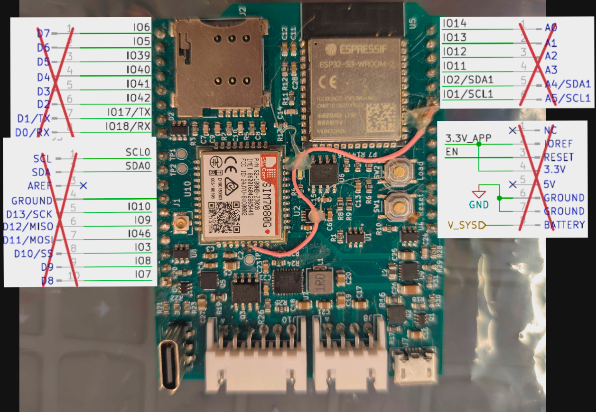

# Wonder board

## Introduction

From our client we got the "Wonder board" it is a board with a lot of functionalities. We only got
the schematic of the wiring without any other information about the board. So in this document I
will try to explain the board from the schematic.

## MCU

The board shipped with an
[ESP32S3](https://www.espressif.com/sites/default/files/documentation/esp32-s3-wroom-2_datasheet_en.pdf)
module.

## Controllable onboard IC's/sensors

### External RTC [DS3231MZ](https://www.analog.com/media/en/technical-documentation/data-sheets/ds3231m.pdf)

- This IC is not directly connected to the clock of the ESP32 and does not act as the crystal
  ossilator for the ESP32.
- It is connected on GPIO 15 to give an 32KHz baseline.
- It is always turned on when a battery is connected and has charged since it is directly connected
  to the battery.
- GPIO21 SDA / GPIO47 SCL
- I2C adress: 0x68

### Dual-Input Power Manager / 3.5A LiFePO4 Battery Charger with I2C Control and USB OTG [LTC4156](https://www.analog.com/media/en/technical-documentation/data-sheets/4156fa.pdf)

- Connected to 5 pin JST connector onboard
- Can handle 2 power inputs at the same time.
- GPIO21 SDA / GPIO47 SCL
- I2C adress: 0x09

### LTE wireless module [SIM7080G](https://www.texim-europe.com/Cmsfile/SMM-SIM7080G-Hardware-Design-V1.04-DS-200525-TE.pdf)

- It is connected using a Serial connection to the MCU Serial pins with an level shifter in between
- Power is togglable with PWRKEY, a pulse is enough to power it on. When pulled down longer than
  12seconds the system will reset
- Current in sleep mode: 1.2mA
- Current in PSM mode: 3uA

## Power

The board has 4 ways of being powered according to the schematic.

| Source                  | Connector      | Pins / Lines                              | Function                           | Notes                                                                         |
| ----------------------- | -------------- | ----------------------------------------- | ---------------------------------- | ----------------------------------------------------------------------------- |
| **USB-C**               | USB-C port     | VBUS, D+, D–, GND                         | Programs ESP32-S3 and powers board | Only port that supports flashing                                              |
| **Micro-USB**           | Micro-USB port | VBUS, GND                                 | Power input only                   | No data lines connected                                                       |
| **4-pin JST**           | JST (4p)       | VIN, GND (x2)                             | External regulated power input     | Feeds into Dual-Input Power Manager, max 5 V                                  |
| **6-pin JST (Battery)** | JST (6p)       | 2×VCC, 2×GND, Thermistor, Thermistor bias | LiFePO4 battery input              | Direct connection to charger/manager (LTC4156). **Must be LiFePO4 chemistry** |

### Output power

The board has a 3.3V voltage regulator that can handle up to 800mAh Continous output current.

### Board power budget

Avaliable 800 mAh

## Extra quirks of the board

- On the board SCL1 and SDA1 are marked with no pull up resistors. Online documentation says that it
  is maybe possible to run it without the pull up resistors.
- The enable pin has a bypass because to the MCU because it has been wired wrongly on the schematic

## Pinout table

| GPIO    | Function    | Connected to      | Notes                   |
| ------- | ----------- | ----------------- | ----------------------- |
| 15      | 32kHz input | DS3231MZ          | Optional clock baseline |
| 21      | I2C SDA     | DS3231MZ, LTC4156 | Shared bus              |
| 47      | I2C SCL     | DS3231MZ, LTC4156 | Shared bus              |
| TX0/RX0 | UART        | SIM7080G          | via level shifter       |
| 1       | BOOT LTE    | SIM7080G          | via MCU                 |

## Global pinout

## Issues
* The schematic has some mistakes, for example the PWRKEY pin of the SIM7080G is grounded directly instead of being connected to the MCU. Making it bootloop. There is a bypass wire on the board. We haven't been succesful in getting the SIM7080G to boot.
* We can't get pins of the MCU to work as expected. For instance we having issues getting pins to pull up. This could be due to incorrect board schematics.
* The board had trouble getting serial data. But to fix that we had to enable usb-cdc in the board config for it to send serial data
