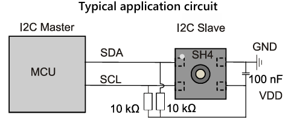
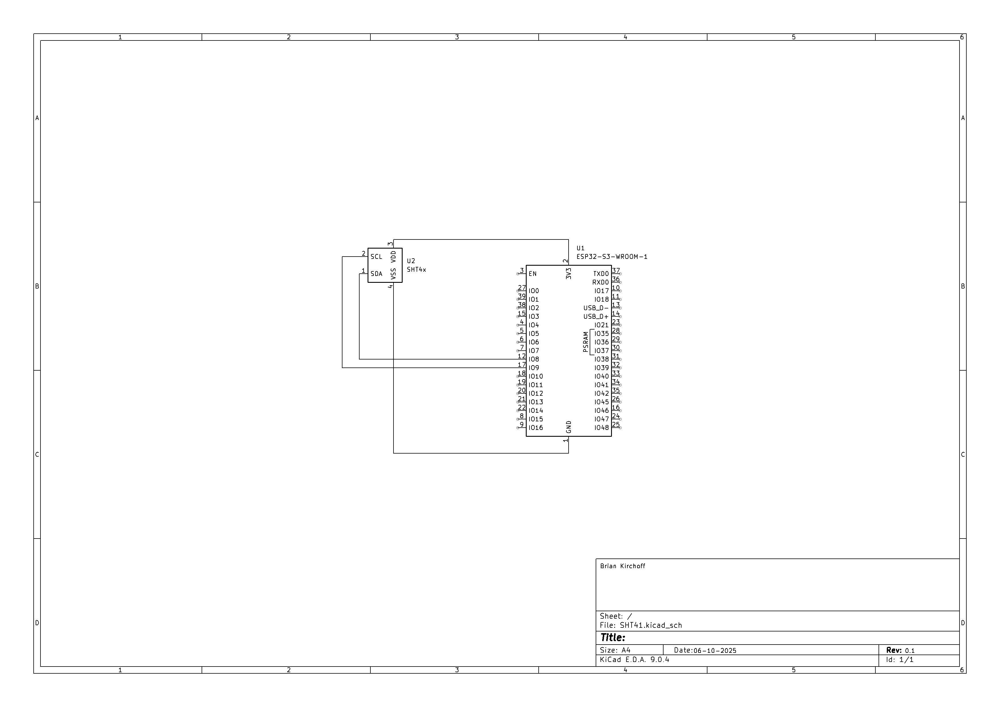

# Hardware interfacing | Temperature and humidity sensor (SHT41)

## General specifications

[https://sensirion.com/products/catalog/SHT41]

### Humidity

**Typ. relative humidity accuracy**<br> 1.8 %RH

**Operating relative humidity range**<br> 0 - 100 %RH

**Response time (τ63%)**<br> 4 seconds

**Calibration certificate**<br> Factory calibration

---

### Temperature

**Typical temperature accuracy**<br> 0.2 °C

**Response time (τ63%)**<br> 2 seconds

---

### Generic

**Supply voltage**<br> 1.08 - 3.6 V

**Average supply current**<br> 0.4 uA

**Operating temperature range [°C]**<br> -40 - 125 °C

---

## SHT41

https://sensirion.com/media/documents/33FD6951/67EB9032/HT_DS_Datasheet_SHT4x_5.pdf

For communication between the SHT41 and the ESP32-S3 MCU, I2C is used. The SHT41's I2C pins (SDA &
SCL) use 10k pull up resistors. The SHT41 can be powered by the ESP32's 3v3 output.



IMPORTANT NOTE: The SHT41's I2C address `0X44` is fixed and cannot be changed.



## Library example

```cpp
#include "SHT41Sensor.h"
#include <Wire.h>

SHT41Sensor sht4; // Uses default pins 8,9 for ESP32-S3

void setup() {
    Serial.begin(115200);
    Wire.begin(8,9); // I2C serial pins for MCU

    if (!sht4.begin()) {
        Serial.println("SHT41 sensor not found!");
        while(1) delay(10);
    }
    Serial.println("SHT41 initialized");
}

void loop() {
    SHT41Data shtData = sht4.readData(75);

    if (shtData.available) {
        Serial.print("Temperature: ");
        Serial.print(shtData.temperature);
        Serial.print(" C, Humidity: ");
        Serial.print(shtData.humidity);
        Serial.println(" %");
    }

    delay(2000);
}
```

## PlatformIO setup

https://www.espboards.dev/sensors/sht41/

Required libraries: adafruit/Adafruit SHT4x Library@^1.0.5

for testing: `platformio.ini`

```ini
[env:esp32dev]
platform = espressif32
board = esp32dev
framework = arduino
lib_deps =
    adafruit/Adafruit SHT4x Library @ ^1.0.0
monitor_speed = 115200
```

---

## Heater

Although probably not applicable in this project, the SHT41 has a built-in heater which can be used
to improve humidity sensing accuracy.
