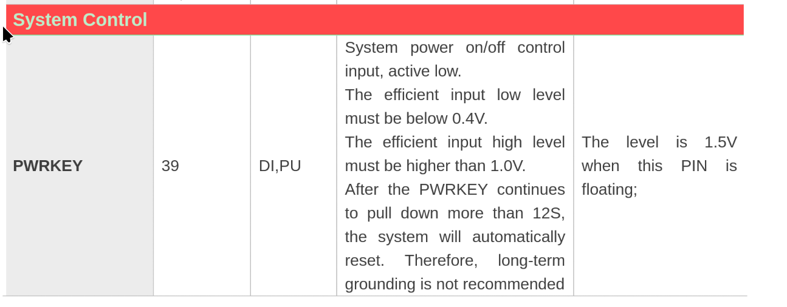
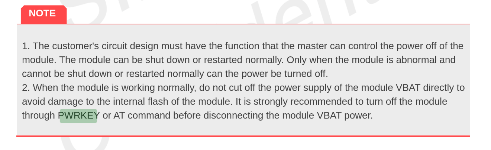

# LTE chip (SIM7080G)

## Introduction
The Wonder board has the SIM7080G chip that is connected to the serial port of the ESP32S3. It has 2 power switches as referenced on [the wonder board docs](../hardware/wonder-board.md). One is to activate/kill the power and one is to boot the RF chip. There are not many libaries available for this chip.

## Antenna choice

## Booting the chip
To boot the LTE module first GPIO 48 need to be pulled up to provide power to the chip. Then GPIO 1 can also be pulled up to power up the chip.

If the chip is non responding the PWRKEY (GPIO 1) can be pulled down for 12 seconds to reset the chip.


Note: Before disconnecting power it is recommended to power down the LTE chip. Otherwise damage could be done to the internal flash.



## Setting up serial communication
Since the chip is directly connected to the ESP32S3's serial port, hardware serial can be used to interface with the chip.

The default baud rate is 0bps. That is because it is set to auto baud rate where it detects the baudrate and matches it. It is limited to detecting:  9600, 19200, 38400, 57600 and 115200 bps. Once communication is set up, the baudrate can be changed to anything up to 3686400bps.

## Controlling the chip
The chip works using AT commands. This is a standardised command set which some vendors extend for specific functions on their chips. 

To check if the chip is alive and active the command ```AT``` can be send and if it is operational it should return ```OK```.

## Sources
* [Full list of AT commands](https://files.waveshare.com/upload/3/39/SIM7080_Series_AT_Command_Manual_V1.02.pdf)
* [Crash course AT commands](https://www.1ot.com/blog/beginners-guide-to-at-commands)
* [SIM7080G Datasheet](https://www.texim-europe.com/Cmsfile/SMM-SIM7080G-Hardware-Design-V1.04-DS-200525-TE.pdf)