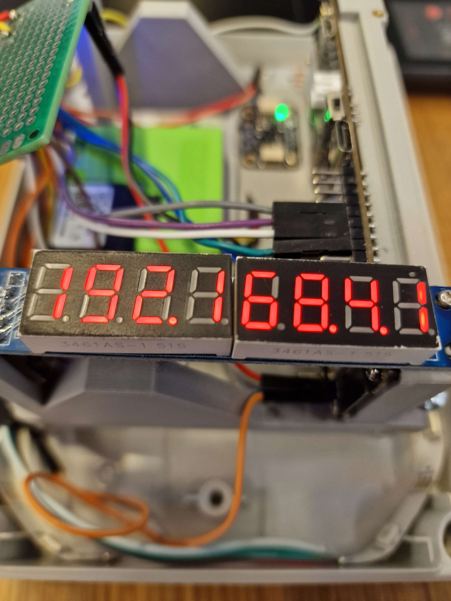
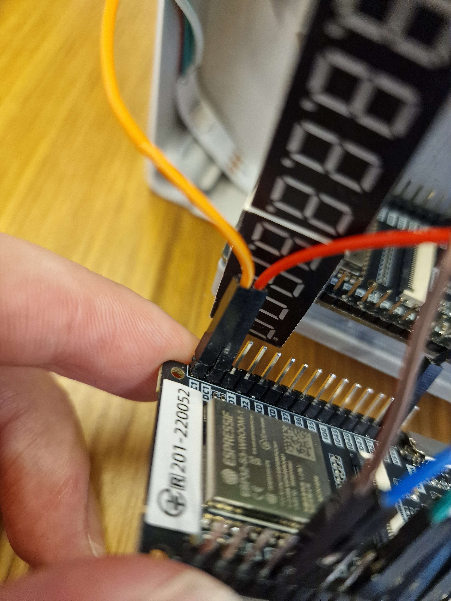
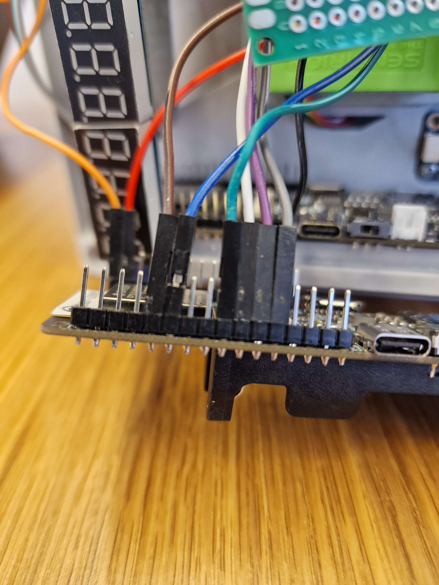
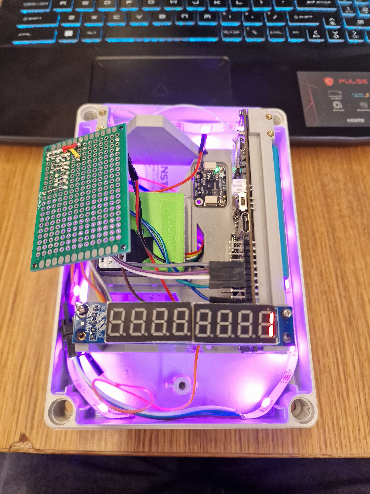

# Running code on LilyGo with battery

## All tests

## 1. Check if code can run with the reset button on battery life.

### - Code to test with

To test if the reset button could run the code automatically. I have tried to clear the **main.cpp (in folder embedded/esp32/src)** file and added the following code instead.

```cpp
#include "Arduino.h"
#include "SegmentDisplay.h"

SegmentDisplay segmentDisplay(11, 12, 10);	// Data, CLK, CS pins

void setup() {
  segmentDisplay.start();
  segmentDisplay.setIPAddress("192.168.4.1");
}

void loop() {}
```

### - Other relevant variables

I have not excluded any particular dependancies. Basically everything in the [esp32](../../embedded/esp32) folder has been used.

### 1.1 Results

So whenever I uploaded the code, I was able to remove the serial connection and keep the code running. This works succesfully.



## 2. Verify if other boards have the same problem not running the code on battery life after resetting.

For this issue I have tried putting the cables from one LilyGo board to another.

### - Wiring pictures of transfering the cables to another board.





### 2.1 Results

The result of this board were the same as with the first test. This one was also succesful resulting in the following.


## 3. Check if parts within the code mess up running the code on battery life.

To verify this step, I will use ChatGPT to go through a couple of thinks to check [main.cpp](../../embedded/esp32/src/main.cpp).

### - while (!Serial);

So one of the things ChatGPT told me to check for **while (!Serial);** and within our code in main I found out that there was indeed this line of code at line 111.

```cpp
void setup() {
  Serial.begin(115200);

  Serial.println();
  Serial.println("====================================");
  Serial.println("Starting GreenMile Air Quality Sensor");

  // Wait for serial port to be ready
  // while (!Serial); <----------- HERE
```
I have commented it out.

### 3.1 Results

After commenting out the following line:

```cpp
while (!Serial);
```

the next thing happened. I was able to press the reset button via cable and the uploaded code worked again. On top of that I can now press the reset button when it is on battery life as well and it runs the code.



The results are succesfull. Only one more problem occured and that is that the SegmentDisplay showed only 1 digit in the end. This is not that big of an issue since we will most likely be removing it anyway. Probable cause of only showing digit might be that code wen't too fast and only set the last digit.