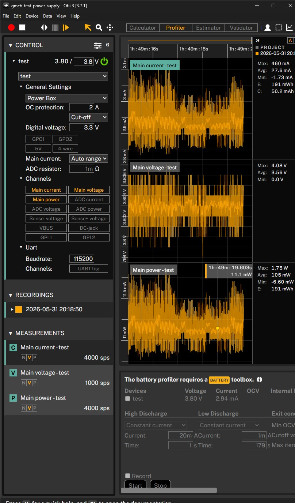

# ESP32 Deep Sleep Power Result: 3 mA Maximum

## Purpose

Document the latest deep sleep power validation after the SPS30 UART migration, runtime cleanup, and
removal of unused display code.

## Test Moment

- Date: Sunday, 31 May 2026.
- Measurement tool: Otii 3 power profiler.
- Main voltage setpoint: `3.8 V`.
- Digital voltage: `3.3 V`.
- Firmware state: current branch firmware after SPS30 UART and display cleanup.
- Mode under test: ESP32 deep sleep after sensor payload flow and peripheral shutdown.

## Result

The Otii capture shows the device settling around the low milliamp range during deep sleep. The
visible deep sleep section is approximately `2.9-3.0 mA`, with a maximum of about `3 mA` in the
settled deep sleep region.

## Conclusion

This confirms a major improvement compared with earlier deep sleep tests that stayed much higher.
The current firmware can now enter deep sleep with a measured current of about `3 mA` maximum in the
settled region.

Remaining investigation:

- The SPS30 datasheet lists microamp-level current for sensor sleep, so the remaining milliamp-level
  draw is likely coming from another board-level load, regulator path, rail leakage, or a peripheral
  that is still powered outside firmware control.
