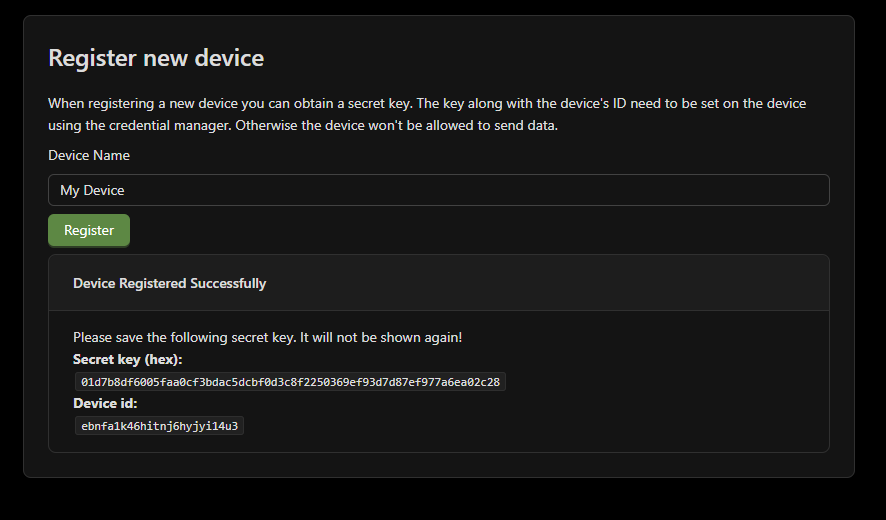

# Frontend

The frontend is a very minimalistic ReactJS application that serves as the user interface for the
CMB system. It is built as a static Single Page Application (SPA) and served using Nginx.

See the README file in `web/frontend` for documentation about the frontend application itself and
how to get started with the project.

## Authentication

Users must authenticate using their username/password and complete a 2FA challenge using TOTP (e.g.
Microsoft Authenticator).

### New Users

You can use a script to create a new user.

1. Login to the server `ssh root@greenmile`
2. Go to the code directory `cd cmb`
3. Run the create user script and change the `username` and `password` to your own credentials.

```bash
bash scripts/create_user.sh "username" "password"
```

You will see a message indicating that a new user is created.

Newly created users must setup their 2FA before they can access the application. After entering
their username/password they will be shown a QR code that they can scan using their TOTP application
of choice.

## Managing devices

### Viewing Device Data

Each device has a unique page that shows the air quality for that device. Press "view data" to get a
link to this page. Or download a QR code for this link to share with others.

### Registering a device

Enter a device name and hit "Register" to add a new device. Once you do this you will be shown the
device's ID and its secret key. Make sure to copy the secret, it will only be shown once.



### Revoking a device

You can revoke a device by hitting the "Revoke" button next to it in the devices list. This will
prevent the device from being able to send any new data to the API.
