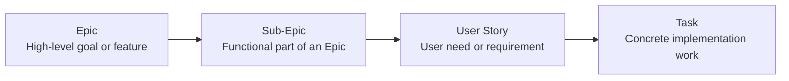
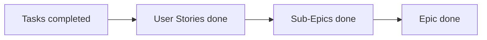

# Scrum Way of Working

## 1. Introduction

This document describes how we apply Scrum within our team. It outlines our way of working, how we structure our backlog, and how we use templates to ensure consistency and clarity.

Our goal is to maintain a transparent, structured, and efficient workflow that supports collaboration and delivers value incrementally.

# Table of Contents

1. [Introduction](#1-introduction)  
2. [Way of Working](#2-way-of-working)  
3. [Backlog Structure](#3-backlog-structure)  
4. [Templates & Usage](#4-templates--usage)  
   4.1 [Epic](#41-epic)  
   4.2 [Sub-Epic](#42-sub-epic)  
   4.3 [User Story](#43-user-story)  
   4.4 [Task](#44-task)  
5. [Relationship Between Work Items](#5-relationship-between-work-items)  
6. [Completion Flow](#6-completion-flow)  
7. [How to Commit](#8-how-to-commit)  
8. [How to Weight Issues](#9-how-to-weight-issues)  
9. [How to Create a Branch](#10-how-to-create-a-branch)  
10. [How to Create a Merge Request](#11-how-to-create-a-merge-request)  
11. [Summary](#12-summary)  

## 2. Way of Working

We follow an iterative Scrum approach, working in sprints to deliver incremental value.

### Key Principles

- Work is organized in a structured backlog
- Each item in the backlog has a clear purpose and level of detail
- Larger work items are broken down into smaller, manageable pieces
- Progress is tracked through clearly defined completion criteria

## 3. Backlog Structure

We organize our backlog using the following hierarchy:

Each level represents a different level of abstraction and detail.

## 4. Templates & Usage

To ensure consistency, we use standardized templates for each backlog item type.

### 4.1 [Epic](../../.gitlab/issue_templates/epic.md)

An **Epic** represents a large body of work that delivers significant value. It typically spans multiple sprints.

#### Purpose

- Capture high-level goals or features
- Provide strategic direction
- Group related work

#### Template Structure

- **Description**  
  High-level explanation of the goal and scope.

- **Definition of Done**
  - All **Blocked by Sub Epics** are completed and checked  
  - All **Blocked by User Stories** are completed and checked  

#### How to Write

- Focus on *why* the work is needed
- Keep it high-level
- Avoid implementation details

### 4.2 [Sub-Epic](../../.gitlab/issue_templates/sub-epic.md)

A **Sub-Epic** breaks an Epic into smaller functional parts.

#### Purpose

- Organize large Epics into logical components
- Represent major features or phases

#### Template Structure

- **Description**  
  Explanation of the specific part of the Epic.

- **Acceptance Criteria**
  - Based on user or stakeholder requirements  
  - Written as a checklist

- **Definition of Done**
  - All **Blocked by User Stories** are completed and checked  
  - All **Acceptance Criteria** are met and checked  

#### How to Write

- Focus on functional outcomes
- Make acceptance criteria clear and testable

### 4.3 [User Story](../../.gitlab/issue_templates/user-story.md)

A **User Story** describes functionality from the user’s perspective.

#### Purpose

- Capture user needs and value
- Serve as the main planning unit for sprints

#### Template Structure

- **Description**  
  Description of the user need.

- **Acceptance Criteria**
  - Defines when the story is successful  
  - Written as a checklist

- **Definition of Done**
  - All **Child items / Tasks** are completed and checked  
  - All **Acceptance Criteria** are met and checked  

#### How to Write

- Use a user-focused format (e.g., *As a user, I want...*)
- Ensure acceptance criteria are measurable and testable
- Ensure acceptance criteria is focussed on user based requirements

### 4.4 [Task](../../.gitlab/issue_templates/task.md)

A **Task** is the smallest unit of work.

#### Purpose

- Define concrete implementation steps
- Break User Stories into actionable work

#### Template Structure

- **Description**  
  Clear explanation of the work to be done

#### How to Write

- Keep tasks small and specific
- Each task should represent one clear action

## 5. Relationship Between Work Items

Each level in the backlog serves a specific purpose:

- **Epics** define large goals  
- **Sub-Epics** break those goals into functional areas  
- **User Stories** describe user-facing functionality  
- **Tasks** define the actual work required  

This structure ensures:

- Clear traceability from idea to implementation  
- Better planning and prioritization  
- Improved collaboration within the team  

## 6. Completion Flow

Work progresses through the hierarchy from top to bottom:

1. An **Epic** is defined  
2. It is split into **Sub-Epics** if needed
3. Sub-Epics are broken down into **User Stories**  
4. User Stories are implemented through **Tasks**  

Completion flows upward:

## 8. How to Commit

To ensure clear and traceable commit history, follow this convention for commit messages:

**Format:**

  #<UserStoryNumber> Add/Update/Delete/Hotfix: Short explanation

**Examples:**

  #42 Add: Implement login endpoint
  #15 Update: Refactor user authentication logic
  #8 Delete: Remove deprecated API routes
  #23 Hotfix: Fix null pointer exception in payment service

**Guidelines:**
- Always reference the relevant user story number at the start (e.g., #42)
- Use one of: Add, Update, Delete, Hotfix
- Provide a concise explanation of the change
- Use English for consistency

## 9. How to Weight Issues

Each issue should be assigned a weight from 1 to 5, representing the estimated effort required:

| Weight | Estimated Time | Description           |
|--------|----------------|-----------------------|
|   5    | 2 weeks        | Very large/complex    |
|   4    | 1 week         | Large                 |
|   3    | 2 days         | Medium                |
|   2    | 1 day          | Small                 |
|   1    | Half a day     | Very small/trivial    |

**Guidelines:**
- Assign weights during backlog refinement or sprint planning
- Use the weight to help with planning and prioritization
- Adjust weights if estimates change during implementation

## 10. How to Create a Branch

To create a branch for your work, follow these steps:

1. Go to the relevant User Story issue in GitLab.
2. Click on the **Create branch** button (usually found near the top or in the sidebar).
3. Use the automatically suggested branch name provided by GitLab. This ensures consistency and traceability between issues and branches.
4. Start working on your branch as usual.

**Tip:**
- Using the auto-generated branch name helps link your work to the issue and keeps the repository organized.

## 12. Summary

This document outlines our Scrum workflow and best practices for collaboration:

- We use a clear backlog hierarchy: Epics, Sub-Epics, User Stories, and Tasks, each with its own template and purpose.
- Work is broken down into manageable pieces, with progress tracked through defined criteria and completion flows from Tasks up to Epics.
- Commit messages follow a strict format referencing the user story and type of change for traceability.
- Issues are weighted from 1 (half a day) to 5 (two weeks) to support planning and prioritization.
- Branches are created directly from user story issues in GitLab, using the auto-generated branch name for consistency.
- Merge requests are created for every feature or fix, with all team members assigned as reviewers to ensure code quality and shared ownership.

By following these guidelines, we ensure our workflow is transparent, efficient, and scalable, enabling the team to deliver high-quality results collaboratively.