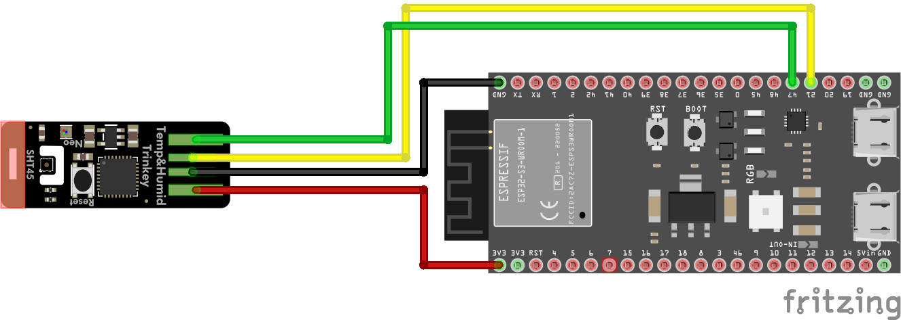
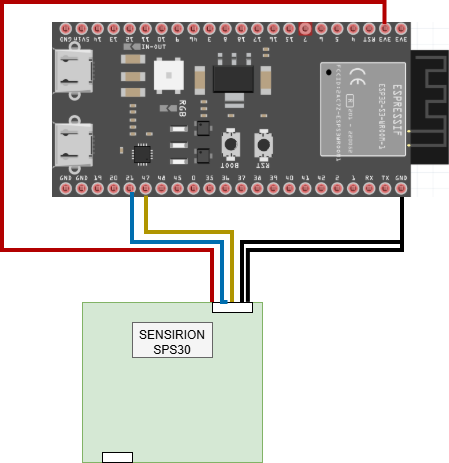
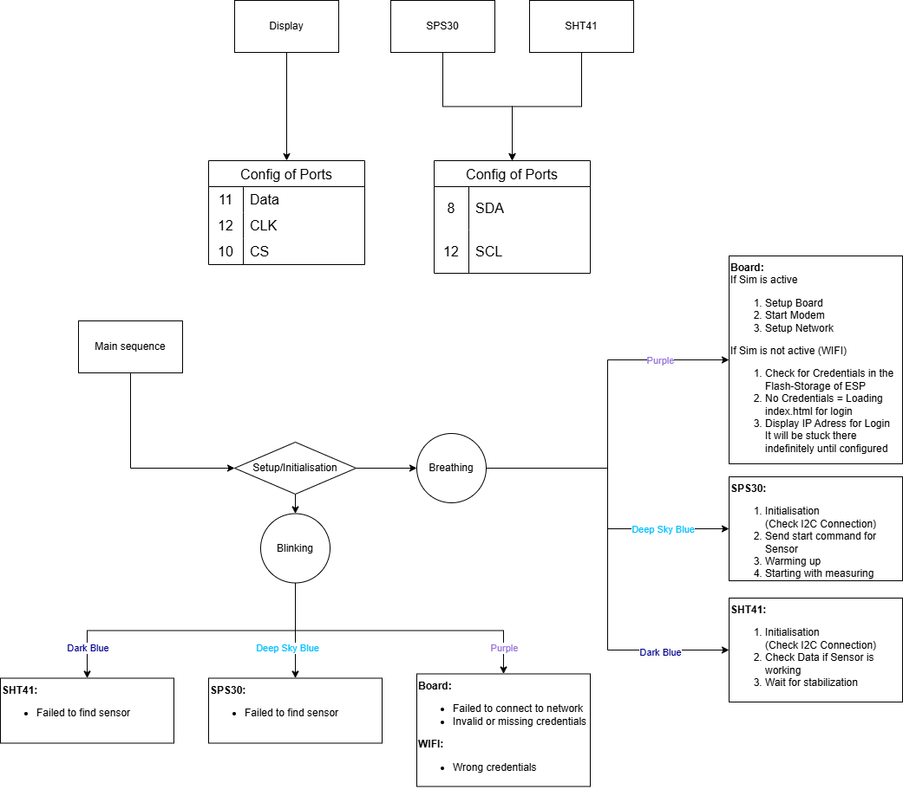
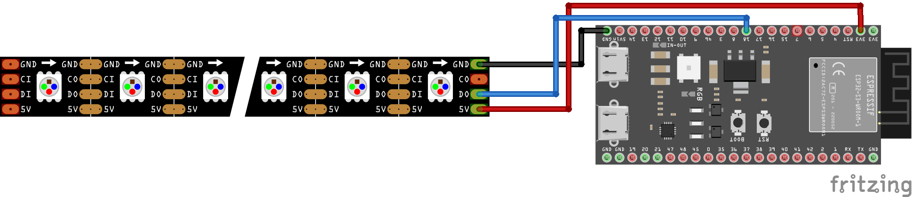
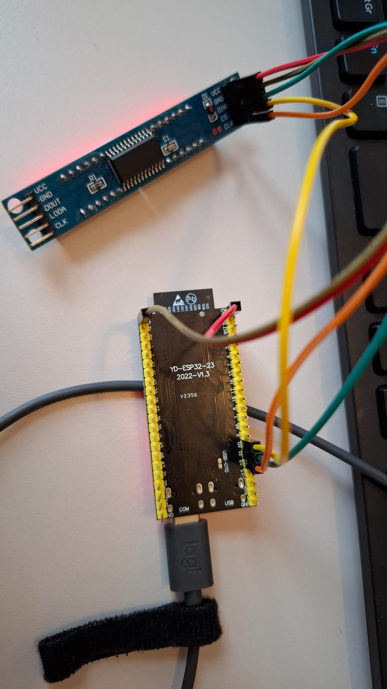

# GreenMile Air Quality Sensor

---

## Project Snapshot
- **Project**: [GreenMileAirQualitySensor](https://github.com/tomvanarman/GreenMileAirQualitySensor/tree/main)
- **MCU**: ESP32
- **Goal**: Real-time air quality monitoring using low-cost, high-accuracy sensors
- **Key Sensors**:  
  - **SHT41** – Temperature & Humidity  
  - **SPS30** – Particulate Matter (PM1.0, PM2.5, PM10)

---

## SHT41: High-Accuracy Environmental Sensor

| Feature | Specification |
|--------|---------------|
| **Type** | Digital Humidity & Temperature Sensor |
| **Interface** | I²C |
| **Measures** | Temperature (°C), Relative Humidity (%RH) |
| **Accuracy** | ±0.2 °C (temp), ±1.5 %RH (humidity) |
| **Range** | -40 °C to +85 °C (temp), 0–100 %RH (humidity) |
| **I²C Address** | `0x44` |
| **Power** | Ultra-low (ideal for battery operation) |



> Used to monitor ambient conditions for context in air quality analysis.

---

## SPS30: Industrial-Grade Particle Counter

| Feature | Specification |
|--------|---------------|
| **Type** | Optical Particle Counter (PM Sensor) |
| **Interface** | I²C |
| **Measures** | PM1.0, PM2.5, PM10 (µg/m³), Particle Size Distribution |
| **Accuracy** | ±10% typical |
| **Range** | 0.1 – 50 µg/m³ |
| **Measurement Cycle** | Every 10 seconds (configurable) |
| **I²C Address** | `0x69` |
| **Power** | ~10 mA (active), low-power mode available |



> Provides real-time data on airborne particulates for accurate air quality assessment. \
> How to test the Sensor and correctly hook it up to the ESP32: [Oasis-Knowledge](https://knowledge.oasis-x.io/sps-30-setup-guide-100)

---

## Sensor Integration in the Project

| Feature | SHT41 | SPS30 |
|--------|-------|-------|
| **Connection** | I²C (GPIO 21/22) | I²C (GPIO 21/22) |
| **Libraries** | `Sensirion SHT4x` | `Sensirion SPS30` |
| **Data Sync** | ~10 sec interval | ~10 sec interval |
| **Output** | Temperature, Humidity | PM1.0, PM2.5, PM10 |
| **Use Case** | Environmental context | Air quality index |

> Both sensors run in parallel and data is combined for comprehensive monitoring.

---

## Hardware Setup (ESP32)

| ESP32 Pin | SHT41 | SPS30 |
|----------|-------|-------|
| **GPIO 21** | SDA | SDA |
| **GPIO 22** | SCL | SCL |
| **3.3V** | VCC | VCC |
| **GND** | GND | GND |


---

## Data Output & Visualization

- **Data Structure**:
  ```cpp
  struct AirQualityData {
    float temperature;
    float humidity;
    float pm10;
    float pm25;
    float pm100;
    unsigned long timestamp;
  };


---

## Behavior according to code during setup




---

## LEDStrip Library

This module encapsulates the control of addressable RGB LED strips (e.g., WS2812/Neopixel) for Arduino-compatible microcontrollers.

### Features

- Initialization of the LED strip
- Set colors for individual LEDs or the entire strip
- Effects and animations (depending on implementation)
- Simple interface for integration into your own projects

### Hardware Connection

- **GND**: Ground
- **V5**: 3.3V Power Supply
- **DIN**: Data line (to Arduino data pin)

### Wiring



---

## 7-Segment Display Library (MAX7219, 7 digits)

This library provides an easy-to-use interface for controlling a 7-digit segment display using the MAX7219/MAX7221 driver chip via the LedControl library. It is designed for Arduino-compatible boards, including ESP32.

### Features
- Display temperature and humidity with one decimal place
- Show battery percentage (0–100%)
- Display IP addresses
- Show error state (all digits 9)
- Adjustable brightness
- Clear left, right, or entire display

### Hardware Connection
- **DIN**: Data line (to Arduino data pin)
- **CLK**: Clock line
- **CS**: Chip Select
- **VCC**: 3.3V
- **GND**: Ground

### Wiring



---