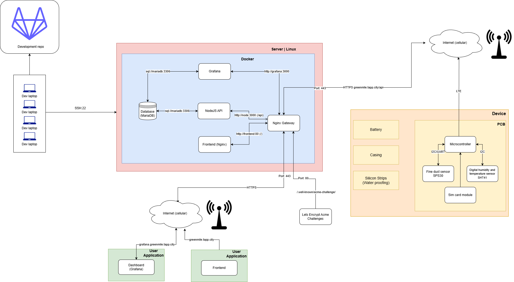

# System Architecture Documentation

## Introduction

The purpose of this system architecture diagram is to provide a high-level overview of the **GreenMile** IoT environmental monitoring system. It illustrates how all hardware and software components interact — from the physical sensor device in the field, through cellular communication, to the cloud server infrastructure and end-user applications. This diagram serves as a reference for developers, stakeholders, and maintainers to understand data flow, deployment topology, and the relationships between each subsystem.

---

## Legend

| Symbol / Color | Meaning |
|---|---|
| **Red/pink background** | **Server / Linux** — The physical or virtual server hosting all backend services |
| **Blue background** | **Docker** — Containerized environment running within the server |
| **Yellow/beige background (right)** | **Device** — The physical IoT sensor device deployed in the field |
| **Smaller yellow box labeled "PCB"** | **Printed Circuit Board** — The electronic board housing the microcontroller and sensors |
| **Green background** | **User Application** — End-user-facing applications (Frontend, Grafana Dashboard) |
| **Laptop icons** | **Dev laptops** — Developer machines used for development and SSH access |
| **Cloud icons** | **Internet (cellular)** — Cellular network connectivity |
| **Antenna/tower icon** | **Cellular base station** — Wireless communication relay |
| **Cylinder icon** | **Database** — MariaDB relational database |
| **Arrows with labels** | **Data flow / communication** — Showing protocols and ports (SSH:22, HTTP, HTTPS, SQL, I2C, UART, LTE) |
| **Git logo (top-left)** | **Development repository** — Version-controlled source code repository |

---

## System Architecture Diagram

---

## Component Descriptions

### 1. Device (IoT Sensor Unit)

The physical device deployed in the field for environmental monitoring. It consists of:

- **Microcontroller** — The central processing unit on the PCB that reads sensor data and transmits it to the server. It communicates with sensors via **I2C** and **I2C/UART** protocols.
- **Fine Dust Sensor (SPS30)** — Measures particulate matter / fine dust concentration in the air. Connected to the microcontroller via **I2C/UART**.
- **Digital Humidity and Temperature Sensor (SHT41)** — Measures ambient temperature and humidity. Connected via **I2C**.
- **SIM Card Module** — Provides **LTE** cellular connectivity, enabling the device to send sensor data to the server over the internet via **HTTPS** to `greenmile.tapp.city/api`.
- **Battery** — Powers the entire device, making it suitable for remote/outdoor deployment.
- **Casing** — The physical enclosure that protects internal components.
- **Silicon Strips (Waterproofing)** — Sealing material to make the device weather-resistant and waterproof.

### 2. Server (Linux)

A Linux-based server that hosts all backend services inside a **Docker** containerized environment:

- **Database (MariaDB)** — The relational database storing all sensor readings, user data, and application state. Accessible internally at `sql://mariadb:3306`. It serves both the NodeJS API and Grafana.
- **NodeJS API** — The backend REST API that receives sensor data from the IoT devices and serves data to the frontend. Runs at `http://node:3000 (/api)`. Connects to MariaDB on port 3306.
- **Frontend (Nginx)** — A static web frontend served by an Nginx web server at `http://frontend:80 (/)`. This is the user-facing web application.
- **Grafana** — A data visualization and dashboarding tool that connects directly to MariaDB (`sql://mariadb:3306`) to display real-time and historical environmental data. Accessible at `http://grafana:3000`.
- **Nginx Gateway** — The main reverse proxy and API gateway that routes incoming traffic on **Port 443 (HTTPS)** to the appropriate internal services — forwarding `/api` requests to the NodeJS API, `/` requests to the Frontend, and Grafana traffic to the Grafana container. It also handles **SSL/TLS termination** for secure communication.

### 3. Let's Encrypt / ACME Challenges

An external certificate authority service. The Nginx Gateway responds to ACME challenges on **Port 80** at the path `/.well-known/acme-challenge/` to automatically obtain and renew **SSL/TLS certificates** from Let's Encrypt, enabling HTTPS.

### 4. Internet (Cellular)

The cellular network acts as the communication bridge between the IoT device in the field and the server. The device sends data over **LTE** to the internet, which reaches the server on **Port 443** via HTTPS.

### 5. User Applications

End users access the system through two web-based applications over the internet:

- **Frontend** — Accessed via `greenmile.tapp.city`. Provides the main user interface for viewing sensor data and interacting with the system.
- **Dashboard (Grafana)** — Accessed via `grafana.greenmile.tapp.city`. Provides rich data visualization dashboards with charts and analytics of the environmental sensor data.

### 6. Development Infrastructure

- **Development Repository (Git)** — A version-controlled repository (e.g., on GitHub/GitLab) where all source code is maintained.
- **Dev Laptops** — Developer machines that connect to the server via **SSH (port 22)** for deployment, debugging, and server administration.

---

> **Data Flow Summary:** The IoT device collects environmental data (fine dust, temperature, humidity) → transmits it via **LTE cellular** → to the **Nginx Gateway** on the server via **HTTPS** → which routes it to the **NodeJS API** → which stores it in **MariaDB** → which is then visualized by **Grafana** and the **Frontend** for end users.

---
### Parts

- SPS30 Air Pollution Sensor
- SHT41 Humidity and Temperature Sensor
- 8 Digit Display Modul
- Powerregulation Modul for LED strip
- LED strip WS2812B
- ESP32S3 WROOM 1

